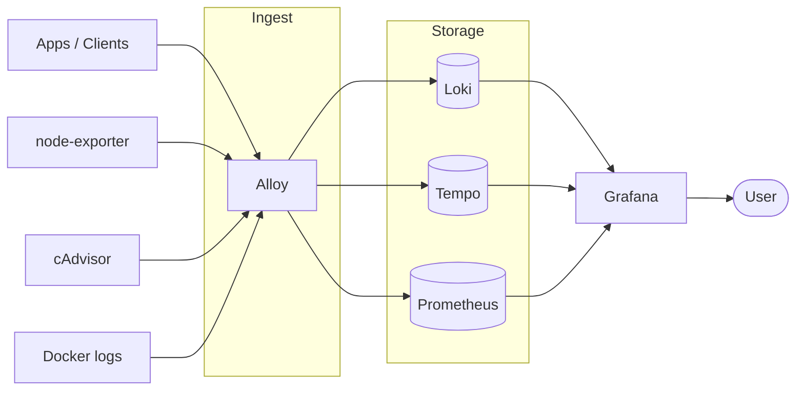

# Dokploy Monitoring Stack


Grafana + Prometheus + Loki + Tempo + Alloy (+ node-exporter, cAdvisor) as a single Dokploy Compose service. One deployment monitors both production and staging, split by an `environment` label.

## Architecture



## Setup in Dokploy

1. **Create Service → Compose**
   - Provider: Git
   - Repository: this repo (or your fork)
   - Branch: `main`
   - Compose path: `docker-compose.yml`

   

2. **Domains** — open the **Domains** tab and add each entry below.

   | Host                    | Path                    | Service   | Container Port |
   | ----------------------- | ----------------------- | --------- | -------------- |
   | `grafana.<your-domain>` | `/`                     | `grafana` | `3000`         |
   | `alloy.<your-domain>`   | `/v1`                   | `alloy`   | `4318`         |
   | `alloy.<your-domain>`   | `/loki`                 | `alloy`   | `3500`         |
   | `alloy.<your-domain>`   | `/api/v1/metrics/write` | `alloy`   | `9090`         |

   

   Grafana login comes from `GRAFANA_ADMIN_USER` / `GRAFANA_ADMIN_PASSWORD` (see `.env.example`, paste into the **Environment** tab).

3. **Protect Alloy with basic auth** (Traefik middleware)

   **a. Generate a hashed credential**

   ```bash
   htpasswd -nb admin 'password'
   # → admin:$apr1$G3T3XOqn$6JGifVcvveyWFg7gYWZjH0
   ```

   **b. Create the middleware** in Dokploy: go to **Dokploy → Settings → Traefik** (or the **Traefik** tab on the server) and open the dynamic config file editor. Add a new file `middlewares.yml` (or append to an existing one):

   ```yaml
   http:
     middlewares:
       alloy-auth:
         basicAuth:
           # admin / password
           users:
             - "admin:$apr1$G3T3XOqn$6JGifVcvveyWFg7gYWZjH0"
   ```

   **c. Attach it to each Alloy domain.** In the service's **Domains** tab, edit each `alloy.<your-domain>` row:

   ```
   alloy-auth@file
   ```

## Environments (production + staging)

Everything is labelled `environment`. Anything collected or received by Alloy gets `ENVIRONMENT` (default `production`, set it in Dokploy's **Environment** tab) unless the sender already set its own:

| Source | How to mark staging |
| --- | --- |
| OTLP (traces/metrics/logs) | resource attribute `deployment.environment=staging` |
| Prometheus remote_write | label `environment="staging"` |
| Loki push | stream label `environment="staging"` |
| Docker logs on this host | container name contains `staging` |

Query with `{environment="staging"}` in both PromQL and LogQL.

Optional: `PROMETHEUS_RETENTION` (default `15d`).

## Dashboards

Provisioned from `monitoring/grafana/dashboards/` into the folder (editable in the UI; redeploy resets them to the repo version):

| Dashboard | Source |
| --- | --- |
| Servers | node-exporter (hub + agents) |
| Containers | cAdvisor (hub + agents) |
| Logs | Loki, all containers + OTLP logs |
| App overview | HTTP / DB / Node runtime auto-instrumentation, `business.event.count` |
| LLM & AI costs | `llm.*`, `voice.*`, `workflow.error.count`, `day_in_life.*` |
| AI Interview voice | `ai_interview.*` |
| Realtime & workers | `ws.*`, `worker.broadcast_*`, `notification.*`, `chat.cleanup.*`, Celery |

OTLP metrics land in Prometheus as `job="<service.name>"`, dots become underscores, units become suffixes (`ms` → `_milliseconds`, `USD` → `_USD`) and counters get `_total`. `user_id` is dropped from metrics to keep cardinality bounded.

## Agent (app servers)

`agent/` ships an app server's container logs, host metrics (node-exporter) and container metrics (cAdvisor) to this hub. Deploy it once per server as its own Dokploy **Compose** service — no domains needed:

- Compose path: `./agent/docker-compose.yml`
- Environment: see `agent/.env.example` (`ENVIRONMENT`, `HOST_NAME`, `ALLOY_USER`, `ALLOY_PASSWORD`)

Requires the Alloy domains to be protected with basic auth (step 3); the agent uses the same credentials.

## Commands

```bash
# bash (curl)
./examples/sh/send-test-log.sh "hello from devops"
./examples/sh/send-test-metric.sh 42
./examples/sh/send-test-trace.sh

# node
cd examples/node && pnpm start
```


